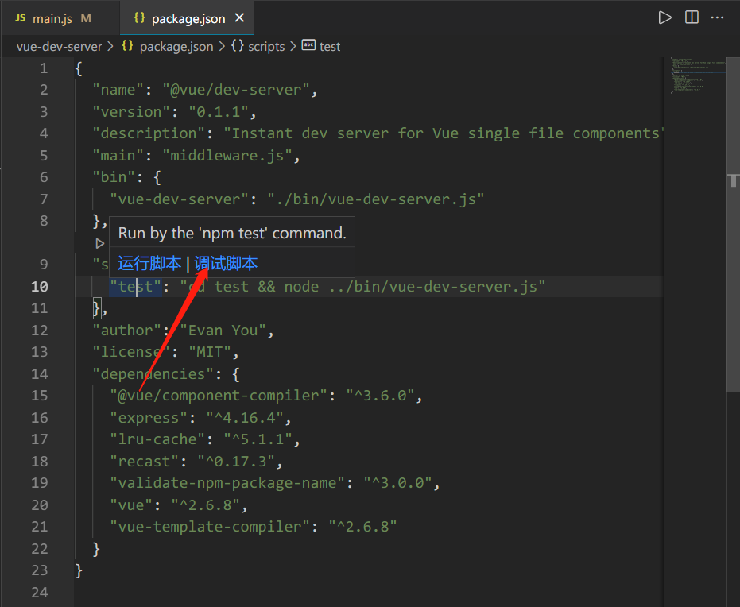

# vue-dev-server-analysis

大家好，我是[若川](https://lxchuan12.gitee.io)。欢迎关注我的[公众号若川视野](https://p1-jj.byteimg.com/tos-cn-i-t2oaga2asx/gold-user-assets/2019/12/13/16efe57ddc7c9eb3~tplv-t2oaga2asx-image.image "https://p1-jj.byteimg.com/tos-cn-i-t2oaga2asx/gold-user-assets/2019/12/13/16efe57ddc7c9eb3~tplv-t2oaga2asx-image.image")，最近组织了[**源码共读活动**《1个月，200+人，一起读了4周源码》](https://mp.weixin.qq.com/s?__biz=MzA5MjQwMzQyNw==&mid=2650756550&idx=1&sn=9acc5e30325963e455f53ec2f64c1fdd&chksm=8866564abf11df5c41307dba3eb84e8e14de900e1b3500aaebe802aff05b0ba2c24e4690516b&token=917686367&lang=zh_CN#rd)，感兴趣的可以加我微信 [ruochuan12](https://mp.weixin.qq.com/s?__biz=MzA5MjQwMzQyNw==&mid=2650756550&idx=1&sn=9acc5e30325963e455f53ec2f64c1fdd&chksm=8866564abf11df5c41307dba3eb84e8e14de900e1b3500aaebe802aff05b0ba2c24e4690516b&token=917686367&lang=zh_CN#rd) 加微信群参与，长期交流学习。

之前写的[《学习源码整体架构系列》](https://juejin.cn/column/6960551178908205093) 包含`jQuery`、`underscore`、`lodash`、`vuex`、`sentry`、`axios`、`redux`、`koa`、`vue-devtools`、`vuex4`十余篇源码文章。

3年前

阅读本文，你将学到：

```bash

```

导读、TODO：


## vue-dev-server

## vue-dev-server 它的原理是什么

[vue-dev-server#how-it-works](https://github.com/vuejs/vue-dev-server#how-it-works)
`README` 文档上有四句英文介绍。

- 原生的JS模块导入，浏览器会发起请求导入
- 
- 
- 

## 准备工作

### 克隆项目
```sh
# 推荐克隆我的仓库
git clone https://github.com/lxchuan12/vue-dev-server-analysis.git
cd vue-dev-server-analysis/vue-dev-server
# npm i -g yarn
# 安装依赖
yarn

# 或者克隆官方仓库
git clone http://github.com/vuejs/vue-dev-server.git
cd vue-dev-server
# npm i -g yarn
# 安装依赖
yarn
```


```json
// vue-dev-server/package.json
{
  "name": "@vue/dev-server",
  "version": "0.1.1",
  "description": "Instant dev server for Vue single file components",
  "main": "middleware.js",
  // 指定可执行的命令
  "bin": {
    "vue-dev-server": "./bin/vue-dev-server.js"
  },
  "scripts": {
    // 先跳转到 test 文件夹，再用 Node 执行 vue-dev-server 文件
    "test": "cd test && node ../bin/vue-dev-server.js"
  }
}
```

根据 `scripts` test 命令。我们来看 test 文件夹。

### test 文件夹

`vue-dev-server/test` 文件夹下有三个文件，代码不长。

- index.html
- main.js
- text.vue

如图下图所示。


接着我们找到 vue-dev-server.js 文件，代码也不长。

### vue-dev-server.js

```js
// vue-dev-server/bin/vue-dev-server.js

#!/usr/bin/env node

const express = require('express')
const { vueMiddleware } = require('../middleware')

const app = express()
const root = process.cwd();

app.use(vueMiddleware())

app.use(express.static(root))

app.listen(3000, () => {
  console.log('server running at http://localhost:3000')
})
```

原来就是

鉴于估计很多小伙伴没有用过`VSCode`调试，这里详细叙述下如何调试源码。**学会调试源码后，源码并没有想象中的那么难**。

### 用 VSCode 调试项目

找到 `scripts` 鼠标移动到 `test` 命令上，会出现`运行脚本`和`调试脚本`命令。如下图所示，选择调试脚本。



>如果你的`VSCode`不是中文（不习惯英文），可以安装[简体中文插件](https://marketplace.visualstudio.com/items?itemName=MS-CEINTL.vscode-language-pack-zh-hans)

>如果`VSCode`没有这个调试功能。建议更新的到最新版`VSCode`。我的目前是最新（`v1.61.2`）。

接着

## vueMiddleware 源码

### 原理现象

我们可以在 `vue-dev-server/bin/vue-dev-server.js` 文件中注释 `app.use(vueMiddleware())`，执行 npm run test 打开 `https://localhost:3000`。


启用中间件后，如下图。


### vueMiddleware

我们可以找到`vue-dev-server/middleware.js`，查看这个中间件函数的概览。

`vueMiddleware` 最终返回一个函数。这个函数里主要做了四件事：
- 对 `.vue` 结尾的文件进行处理
- 对 `.js` 结尾的文件进行处理
- 对 `/__modules/` 开头的文件进行处理
- 如果不是以上三种情况，执行 `next` 方法，把控制权交给下一个中间件

```js
// vue-dev-server/middleware.js

const vueMiddleware = (options = defaultOptions) => {
  // 省略
  return async (req, res, next) => {
    // 省略
    // 对 .vue 结尾的文件进行处理
    if (req.path.endsWith('.vue')) {
    // 对 .js 结尾的文件进行处理
    } else if (req.path.endsWith('.js')) {
    // 对 /__modules/ 开头的文件进行处理
    } else if (req.path.startsWith('/__modules/')) {
    } else {
      next()
    }
  }
}
exports.vueMiddleware = vueMiddleware
```

接着我们来看下具体是怎么处理的。

### 对 .vue 结尾的文件进行处理

```js
const key = parseUrl(req).pathname
let out = await tryCache(key)

if (!out) {
  // Bundle Single-File Component
  const result = await bundleSFC(req)
  out = result
  cacheData(key, out, result.updateTime)
}

send(res, out.code, 'application/javascript')
```

### parseUrl

### 缓存

```js
let cache
let time = {}
if (options.cache) {
  const LRU = require('lru-cache')

  cache = new LRU({
    max: 500,
    length: function (n, key) { return n * 2 + key.length }
  })
}
```

### tryCache

```js
async function tryCache (key, checkUpdateTime = true) {
  const data = cache.get(key)

  if (checkUpdateTime) {
    const cacheUpdateTime = time[key]
    const fileUpdateTime = (await stat(path.resolve(root, key.replace(/^\//, '')))).mtime.getTime()
    if (cacheUpdateTime < fileUpdateTime) return null
  }

  return data
}
```

### cacheData

```js
function cacheData (key, data, updateTime) {
  const old = cache.peek(key)

  if (old != data) {
    cache.set(key, data)
    if (updateTime) time[key] = updateTime
    return true
  } else return false
}
```

### send

### bundleSFC

```js
async function bundleSFC (req) {
  const { filepath, source, updateTime } = await readSource(req)
  const descriptorResult = compiler.compileToDescriptor(filepath, source)
  const assembledResult = vueCompiler.assemble(compiler, filepath, {
    ...descriptorResult,
    script: injectSourceMapToScript(descriptorResult.script),
    styles: injectSourceMapsToStyles(descriptorResult.styles)
  })
  return { ...assembledResult, updateTime }
}
```

### readSource

```js
const path = require('path')
const fs = require('fs')
const readFile = require('util').promisify(fs.readFile)
const stat = require('util').promisify(fs.stat)
const parseUrl = require('parseurl')
const root = process.cwd()

async function readSource(req) {
  const { pathname } = parseUrl(req)
  const filepath = path.resolve(root, pathname.replace(/^\//, ''))
  return {
    filepath,
    source: await readFile(filepath, 'utf-8'),
    updateTime: (await stat(filepath)).mtime.getTime()
  }
}

exports.readSource = readSource
```

### 对 .js 结尾的文件进行处理

```js
const key = parseUrl(req).pathname
let out = await tryCache(key)

if (!out) {
  // transform import statements
  const result = await readSource(req)
  out = transformModuleImports(result.source)
  cacheData(key, out, result.updateTime)
}

send(res, out, 'application/javascript')
```

### transformModuleImports

```js
const recast = require('recast')
const isPkg = require('validate-npm-package-name')

function transformModuleImports(code) {
  const ast = recast.parse(code)
  recast.types.visit(ast, {
    visitImportDeclaration(path) {
      const source = path.node.source.value
      if (!/^\.\/?/.test(source) && isPkg(source)) {
        path.node.source = recast.types.builders.literal(`/__modules/${source}`)
      }
      this.traverse(path)
    }
  })
  return recast.print(ast).code
}

exports.transformModuleImports = transformModuleImports
```

### 对 /__modules/ 开头的文件进行处理

```js
const key = parseUrl(req).pathname
const pkg = req.path.replace(/^\/__modules\//, '')

let out = await tryCache(key, false) // Do not outdate modules
if (!out) {
  out = (await loadPkg(pkg)).toString()
  cacheData(key, out, false) // Do not outdate modules
}

send(res, out, 'application/javascript')
```

### loadPkg 加载包

```js
const fs = require('fs')
const path = require('path')
const readFile = require('util').promisify(fs.readFile)

async function loadPkg(pkg) {
  if (pkg === 'vue') {
    const dir = path.dirname(require.resolve('vue'))
    const filepath = path.join(dir, 'vue.esm.browser.js')
    return readFile(filepath)
  }
  else {
    // TODO
    // check if the package has a browser es module that can be used
    // otherwise bundle it with rollup on the fly?
    throw new Error('npm imports support are not ready yet.')
  }
}

exports.loadPkg = loadPkg
```

## 总结
